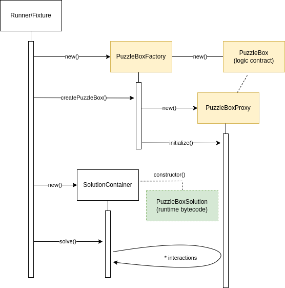

# PuzzleBox CTF

Do you have what it takes to unlock this devious solidity puzzle box? You will need to demonstrate your understanding of the EVM, solidity, and smart contract vulnerabilities and chain them together in an exact sequence to get inside. How far can you get?

## Setup

```bash
# clone this repo
git clone git@github.com:dragonfly-xyz/puzzlebox-ctf.git && cd puzzlebox-ctf
# install foundry
forge install
# run/check your solution
forge test -vvvv
```

## PuzzleBox Design



Puzzlebox instances use a familiar proxy pattern, with the main logic contract being [`PuzzleBox`](./src/PuzzleBox.sol#L41) and the proxy contract being [`PuzzleBoxProxy`](./src/PuzzleBox.sol#L5). The contract that deploys and initializes puzzleboxes is [`PuzzleBoxFactory`](./src/PuzzleBox.sol#L306). All 3 contain vital clues for defeating the challenges.

[`PuzzleBoxSolution`](./src/PuzzleBoxSolution.sol) is a contract with an incomplete `solve()` function where you should implement your solution against the provided `PuzzleBox` instance. The [tests](./test/PuzzleBox.t.sol) will deploy and call this contract to verify your solution.

* One important thing to note is that your `PuzzleBoxSolution` is never directly instantiated, meaning *its constructor will never be executed*. Instead, a shell contract ([`SolutionContainer`](./test/PuzzleBox.t.sol#L37)) that deploys itself using your solution's runtime bytecode will be created in its place. This confines as much business logic as possible to your solution's `solve()` function for fairness.

In the contest, your solution will be scored based on how many challenges it completes, with a bonus given to more gas efficient solutions. *Only the gas you spend inside `solve()` is counted.*

Beyond the contest, this is intended to be an educational resource so even partial solutions can be submitted and awarded a score!

### Project Structure
This project is designed to loosely emulate the evaluation environment of the contest. In the contest, everything happens in 1 transaction, and is orchestrated by a "runner" contract. The runner is in charge of deploying the puzzlebox, your solution, and calling `solve()`, atomically. In this repo, the provided test case ([`test_win`](./test/PuzzleBox.t.sol#L29)) simulates the role of the runner.
